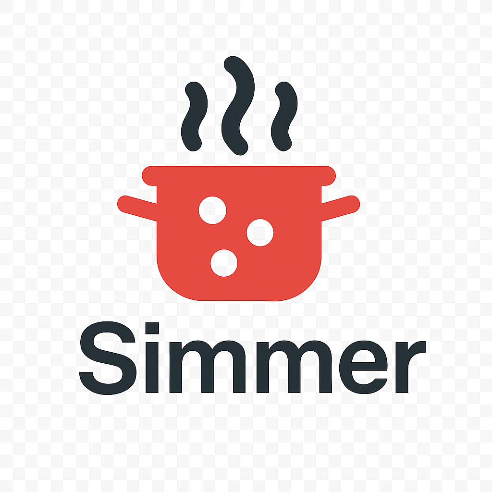

<p align="center">
  
</p>

# Simmer

[](https://github.com/utensils/Simmer/actions/workflows/build.yml)
[](https://github.com/utensils/Simmer/actions/workflows/test.yml)
[](https://github.com/utensils/Simmer/actions/workflows/lint.yml)
[](https://codecov.io/gh/utensils/Simmer)
[](https://swift.org)
[](https://www.apple.com/macos)
[](LICENSE)

Passive log monitoring for macOS with subtle visual feedback.

## What is Simmer?

Simmer lives in your menu bar and watches log files for patterns you care about. When it finds a match, the icon subtly glows or pulses. No intrusive notifications, no terminal overload—just ambient awareness of your systems.

Perfect for monitoring verbose worker queues, background jobs, or any logs that would otherwise flood your terminal during development.

## Status

**MVP Release Candidate** - Core features implemented and tested. Preparing for initial release.

## Features

- ✅ Watch up to 20 log files simultaneously
- ✅ Configure regex patterns with custom colors and animations (glow, pulse, blink)
- ✅ Menu bar icon animations at 60fps with graceful degradation
- ✅ Recent matches menu (10 most recent with timestamps)
- ✅ Full pattern CRUD in settings UI
- ✅ Export/import configurations as JSON
- ✅ Launch at login support
- ✅ Minimal resource usage (<1% CPU idle, <5% active, <50MB memory)
- ✅ File permission and deletion error handling
- ✅ High-frequency match warnings

## Requirements

- macOS 14.0+ (Sonoma)
- Xcode 15.0+

## Quick Start

1. Download the latest release from [Releases](https://github.com/utensils/simmer/releases)
2. Open the DMG and drag Simmer to Applications
3. Launch Simmer from Applications
4. Click the menu bar icon → Settings to configure your first pattern
5. Add a log file path and regex pattern
6. Watch the icon animate when patterns match

## Building from Source

```bash
git clone https://github.com/utensils/simmer.git
cd simmer
open Simmer.xcodeproj
# Build and run from Xcode (Cmd+R)
```

**Requirements**:
- Xcode 15.0+
- Swift 5.9+
- macOS 14.0+ SDK

## Documentation

- [VISION.md](VISION.md) - Product vision and scope
- [TECH_DESIGN.md](TECH_DESIGN.md) - Technical architecture
- [STANDARDS.md](STANDARDS.md) - Coding standards
- [CLAUDE.md](CLAUDE.md) - AI assistant guidelines

## License

MIT License - see LICENSE file for details.

## Author

James Brink

## Configuration

Patterns support:
- **Regex**: Full NSRegularExpression syntax
- **Paths**: Tilde (`~`), environment variables (`$HOME`), wildcards
- **Colors**: RGB color picker
- **Animations**: Glow (smooth fade), Pulse (scale + fade), Blink (hard on/off)
- **Import/Export**: Share configs as JSON files

## Performance

Simmer is designed to run passively without impacting system performance:
- <1% CPU when idle
- <5% CPU during active monitoring
- <50MB memory footprint
- 60fps icon animations with graceful degradation
- <10ms pattern matching per line

## Contributing

Issues and PRs welcome! See [STANDARDS.md](STANDARDS.md) for coding guidelines and [TECH_DESIGN.md](TECH_DESIGN.md) for architecture details.
